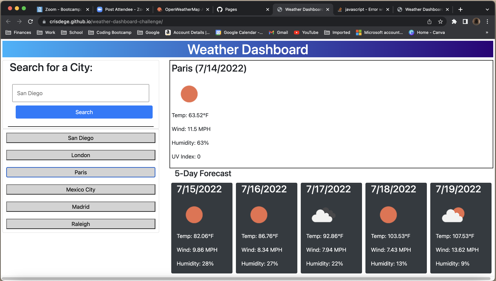

# weather-dashboard-challenge

This app uses the OpenWeather API to get the longitude and latitude of a provided city. It then pulls the current and 5 Day weather forecast. It will also save the previous searches and display on screen with ability to access the info.

